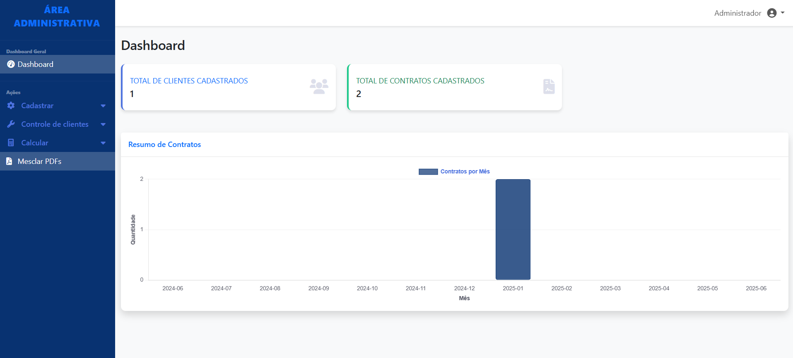
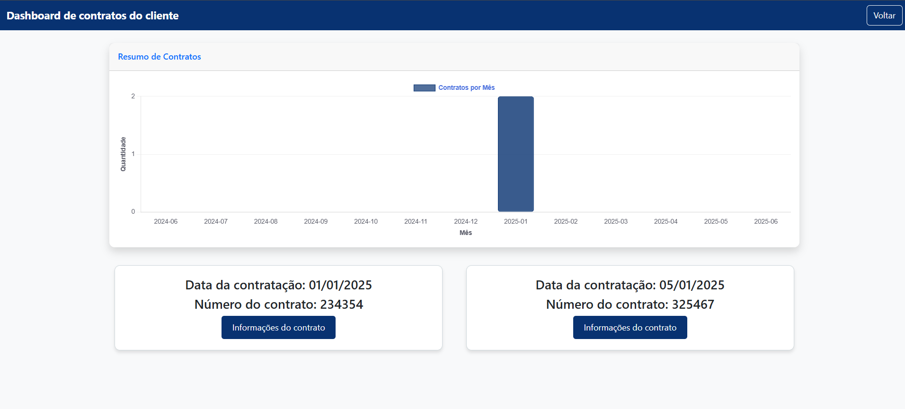
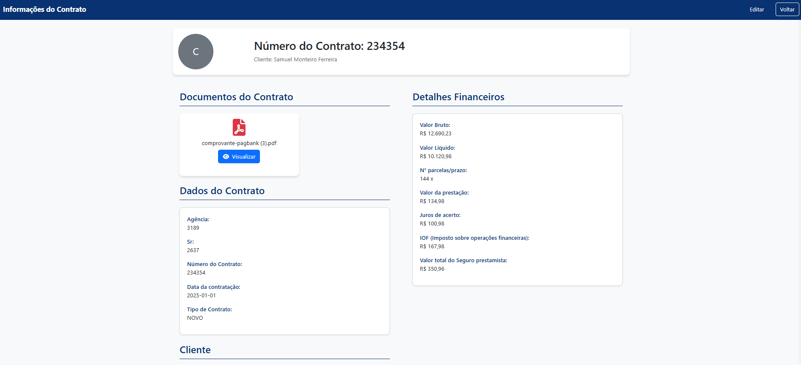
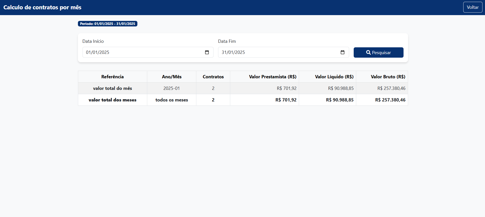
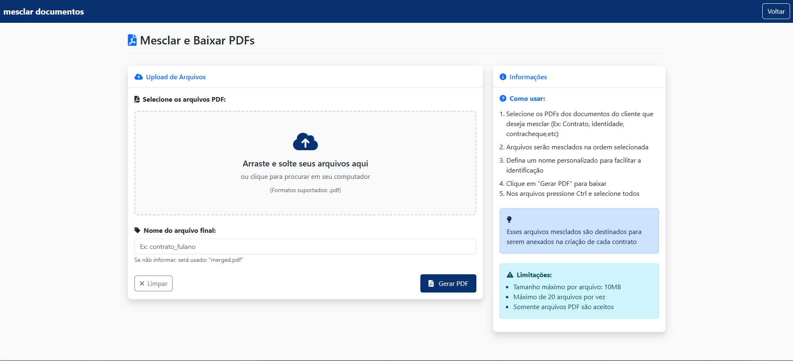

# 📊 Sistema administrativo com Dashboard e controle de contratos e clientes

Este projeto é um sistema administrativo para 
uma empresa de empréstimos e contratos.
Desenvolvido com a proposta de solucionar dores reais
dos funcionários e chefes. O projeto consiste 
em funcionalidades que automatizam alguns processos
lentos dentro da empresa e auxilia na organização 
tanto dos clientes, como dos contratos e documentos,
esse sistema consiste na centralização dos dados de uma
forma bastante simples, cada cliente vai ter seus
respectivos contratos associados, e cada contrato terá
seu documento anexado, melhorando assim a produtividade
dos funcionários e livrando eles de atividades manuais
que demandam certo tempo.

---
## Evidências visuais:

### Login

### Dashboard geral

### cadastro de cliente

### cadastro de contratos

### controle de cliente

### detalhes do cliente

### controle de cada contrato
- Dashboard de contratos para cada cliente com seus respectivos contratos:

- informações do contrato para cada contrato selecionado:
  
- vizualização de Pdf do contrato
  

### Calculo dos contratos
- vizualização dos calculos dos contratos
  

### mesclagem (junção) dos documentos
- página onde será feito a junção dos documentos
do cliente e feito o download de um pdf único.
  
---

## 🚀 Funcionalidades

1. **Gráfico de Contratos por Mês**:
    - Exibe a quantidade de contratos feitos por mês em um gráfico de barras interativo.
    - Desenvolvido com **Chart.js**.

2. **Controle de Contratos**:
    - Uma página onde é possível visualizar todos os contratos cadastrados.
    - Cada contrato é exibido em um cartão com informações como nome do cliente, data de contratação e número do contrato.

3. **Interface**:
    -  **Bootstrap**.
    - Navbar com tema azul escuro.
    - Botões estilizados e efeitos hover.

---

## 🛠️ Tecnologias Utilizadas

- **Backend**:
    - Spring Boot
    - Spring Data JPA
    - Thymeleaf (para renderização de templates HTML)
    - PostgreSQL (banco de dados)

- **Frontend**:
    - Bootstrap (para estilos e layout responsivo)
    - Chart.js (para gráficos interativos)
    - JavaScript (para interatividade)