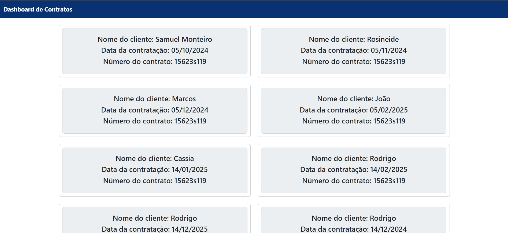

# 📊 Dashboard de Contratos

Este projeto é um **Dashboard de Contratos** desenvolvido com **Spring Boot** e **Thymeleaf**. Ele permite visualizar a quantidade de contratos por mês em um gráfico de barras e acessar uma página de controle de contratos, onde é possível listar todos os contratos cadastrados.

---
## Imagem do Dashboard:

## Imagem do controle: 

---

## 🚀 Funcionalidades

1. **Gráfico de Contratos por Mês**:
    - Exibe a quantidade de contratos feitos por mês em um gráfico de barras interativo.
    - Desenvolvido com **Chart.js**.

2. **Controle de Contratos**:
    - Uma página onde é possível visualizar todos os contratos cadastrados.
    - Cada contrato é exibido em um cartão com informações como nome do cliente, data de contratação e número do contrato.

3. **Interface**:
    -  **Bootstrap**.
    - Navbar com tema azul escuro.
    - Botões estilizados e efeitos hover.

---

## 🛠️ Tecnologias Utilizadas

- **Backend**:
    - Spring Boot
    - Spring Data JPA
    - Thymeleaf (para renderização de templates HTML)
    - PostgreSQL (banco de dados)

- **Frontend**:
    - Bootstrap (para estilos e layout responsivo)
    - Chart.js (para gráficos interativos)
    - JavaScript (para interatividade)